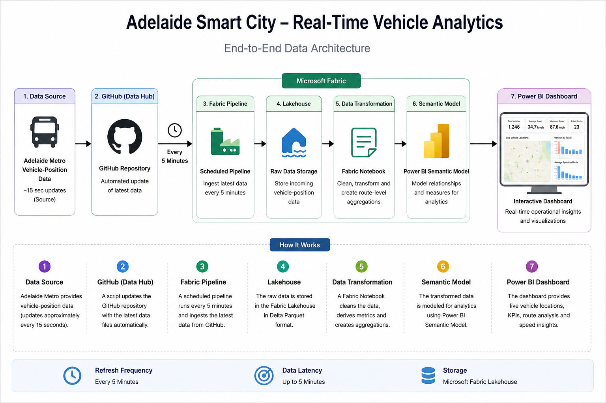

# Adelaide Smart City — Real-Time Vehicle Analytics

An end to end Microsoft Fabric data engineering and analytics project built using Adelaide Metro vehicle position data.

The solution automatically ingests updated vehicle-position data every 5 minutes, stores and transforms the data in a Microsoft Fabric Lakehouse, and presents operational insights through an interactive Power BI dashboard.

---

## 📊 Project Overview

This project demonstrates an end to end data analytics workflow from source data to dashboard:

**GitHub → Fabric Pipeline → Lakehouse → Transformation → Semantic Model → Power BI**

The dashboard provides an operational view of:

- 🚍 Total vehicles
- 📈 Average speed
- ⚡ Maximum speed
- 🛣️ Active routes
- 📍 Live vehicle locations across Adelaide
- 🚍 Vehicle count by route
- 📊 Average speed by route

---

## 🏗️ Architecture

The solution follows a simple end to end analytics pipeline:

1. **Data Source**  
   Adelaide Metro vehicle position data provides the source vehicle information.

2. **Automated Ingestion**  
   GitHub Actions automatically updates the raw vehicle-position data, while a Microsoft Fabric pipeline ingests the latest data every 5 minutes.

3. **Data Storage**  
   The incoming data is stored in a Microsoft Fabric Lakehouse.

4. **Data Transformation**  
   A Fabric Notebook cleans and transforms the vehicle position data and creates route level summary information.

5. **Semantic Model**  
   The transformed data is exposed through a Power BI semantic model.

6. **Power BI Dashboard**  
   The dashboard presents operational insights including vehicle locations, vehicle counts, route activity and speed metrics.

---

## 🧩 Challenges & Engineering Decisions

One of the main challenges was obtaining the highest-frequency vehicle-position data directly through the Microsoft Fabric environment.

The original data source provides vehicle-position updates at a higher frequency. However, the available Microsoft Fabric subscription and configuration did not provide direct access to the full 15-second real-time feed required for the project.

### Solution

Instead of relying on direct access to the full real-time feed, I designed an alternative ingestion workflow using GitHub as an intermediate data source.

The workflow is:

**Vehicle Data Source → GitHub → Fabric Pipeline → Lakehouse → Transformation → Power BI**

GitHub Actions automatically updates the latest vehicle-position data, and the Microsoft Fabric pipeline is scheduled to ingest the updated data every **5 minutes**.

This provided a practical near-real-time analytics solution while working within the available platform limitations.

### Key Learning

This project was a useful lesson in designing data pipelines around real-world constraints. Rather than depending on a single ingestion method, I explored an alternative architecture that allowed the dashboard to receive continuously updated data while working within the available platform capabilities.

---

## 🔗 Data Source

This project uses Adelaide Metro vehicle-position data provided through the Adelaide Metro GTFS-Realtime feed.

**Official source:** [Adelaide Metro GTFS-Realtime API](https://gtfs.adelaidemetro.com.au/)

The vehicle-position feed provides current vehicle locations and related information in GTFS-Realtime format.

The source data is then processed through the GitHub and Microsoft Fabric ingestion workflow used in this project.

---

## 📈 Power BI Dashboard

The Power BI dashboard provides an interactive operational view of the Adelaide Metro vehicle network.

### Key Metrics

- **Total Vehicles** — current number of vehicles represented in the dataset
- **Average Speed** — current average vehicle speed
- **Maximum Speed** — highest recorded vehicle speed
- **Active Routes** — number of routes currently represented

### Visualizations

- **Live Vehicle Locations** — map showing vehicle positions across Adelaide
- **Vehicles by Route** — vehicle distribution across routes
- **Average Speed by Route** — comparison of average speeds across routes

The dashboard is refreshed as new vehicle-position data is processed through the automated 5-minute ingestion pipeline.

---

## 🛠️ Technologies Used

- **Microsoft Fabric**
  - Data Pipeline
  - Lakehouse
  - Notebooks
  - Semantic Model
- **Power BI**
- **Python / PySpark**
- **SQL**
- **GitHub**
- **GitHub Actions**
- **GTFS-Realtime**

---

## 🚀 Project Outcome

The final solution demonstrates how a modern data platform can be used to build an automated vehicle analytics workflow from ingestion through to visualization.

The project combines automated data updates, cloud data engineering, transformation, data modelling and business intelligence into a single end-to-end solution.
